# [My first look to okta](https://derejekitawokta.surge.sh/)
[Source](https://developer.okta.com/blog/2017/10/19/build-a-preact-app-with-authentication) 

 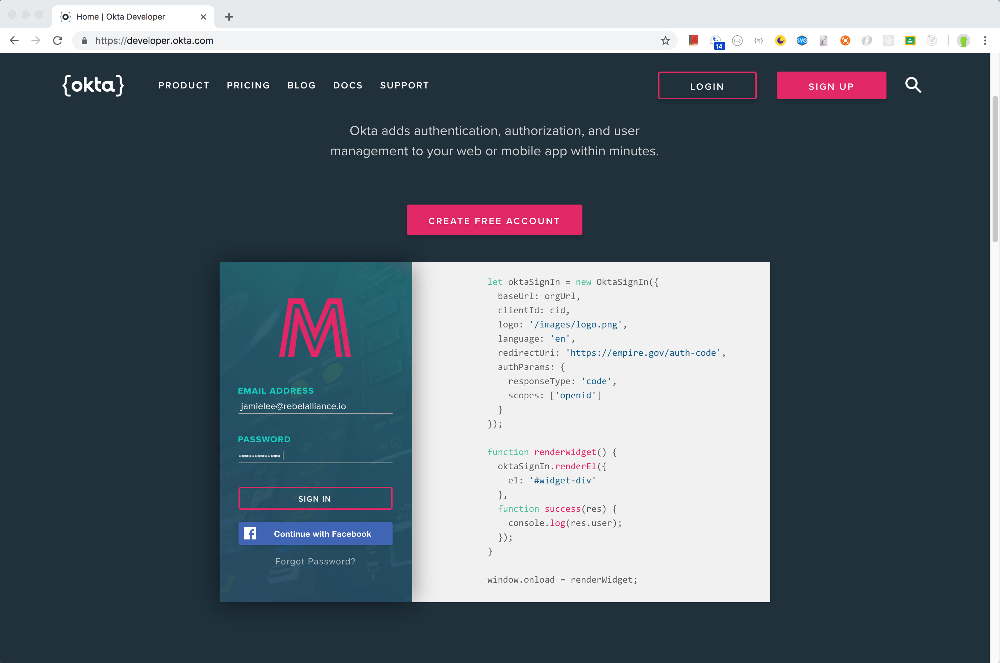
 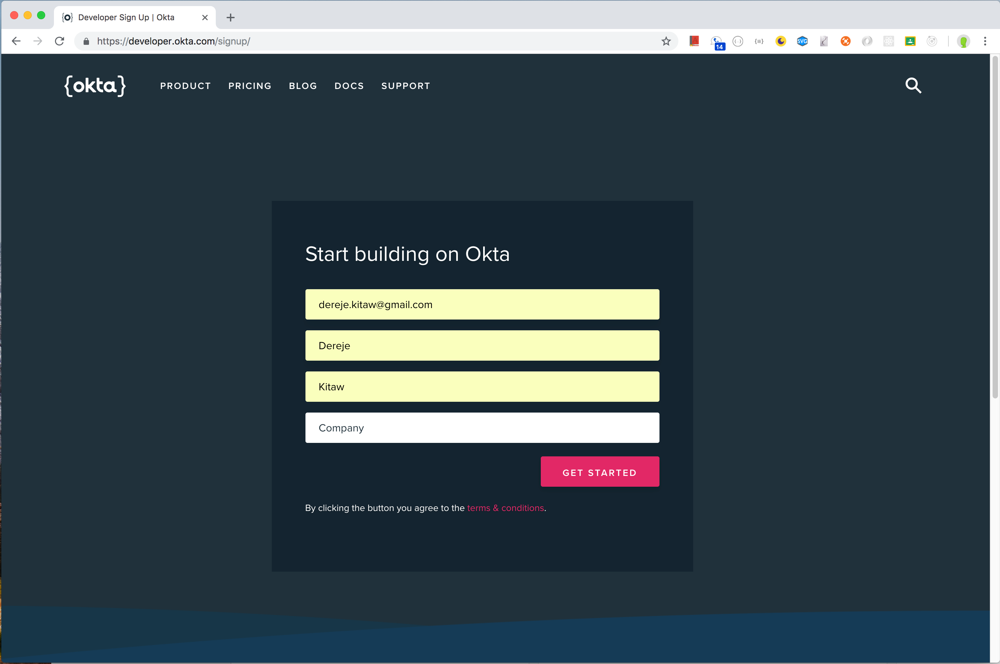
 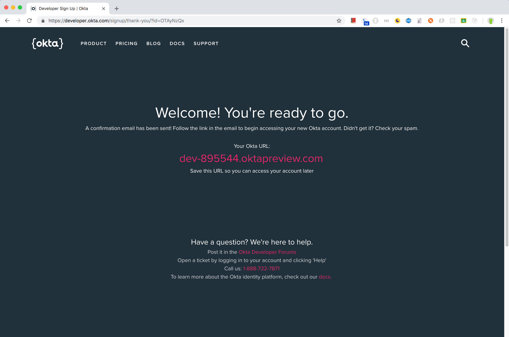
 
 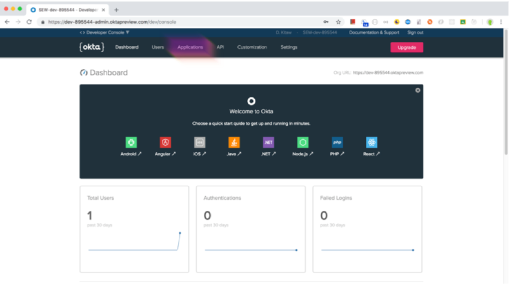
 
 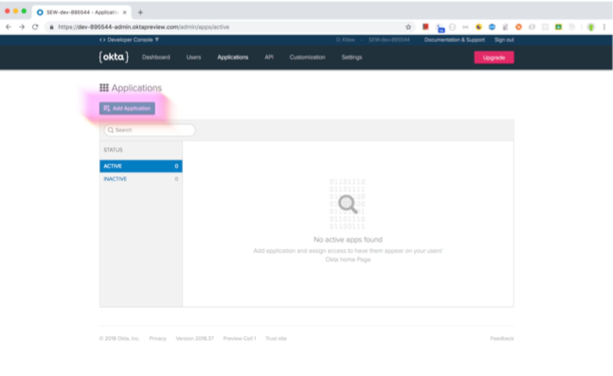
 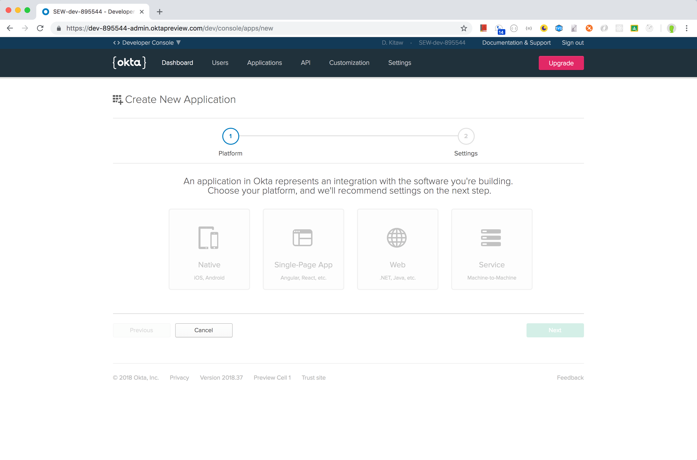
 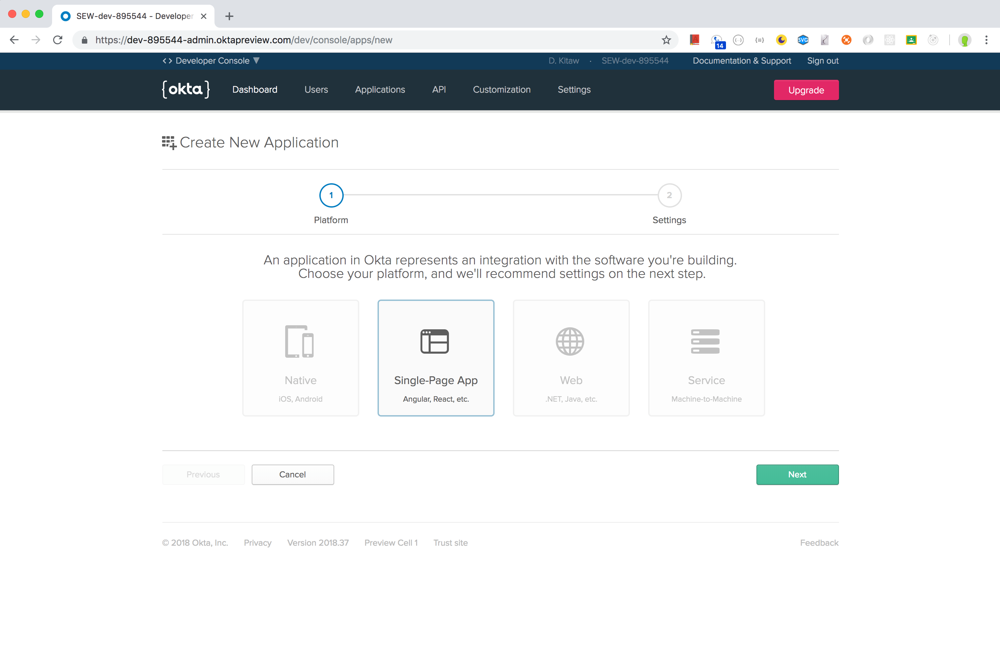
 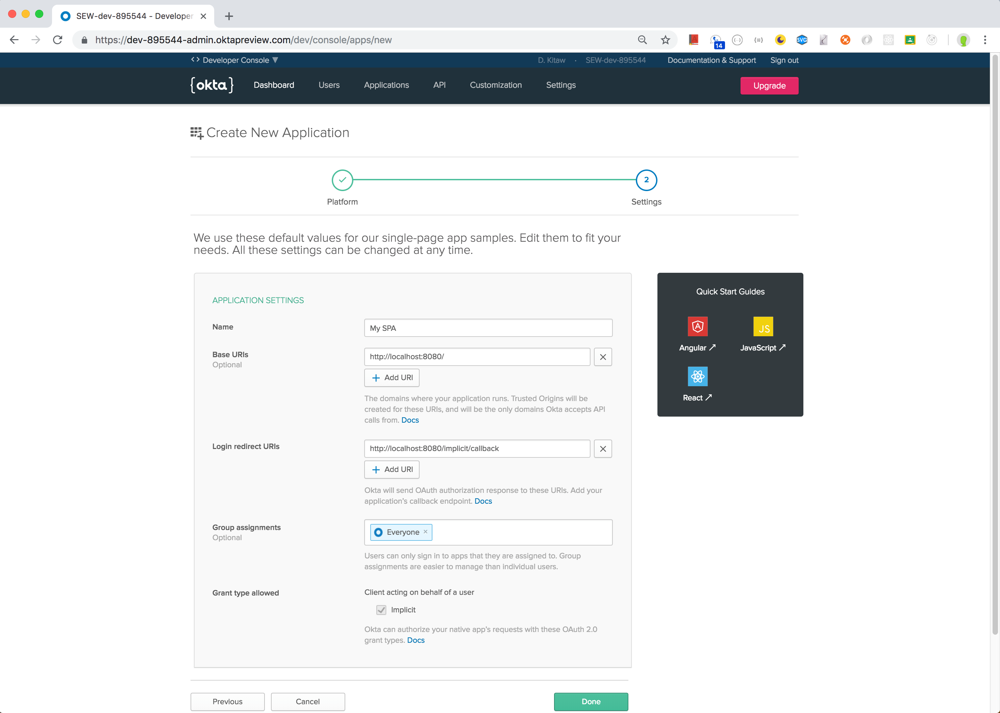
 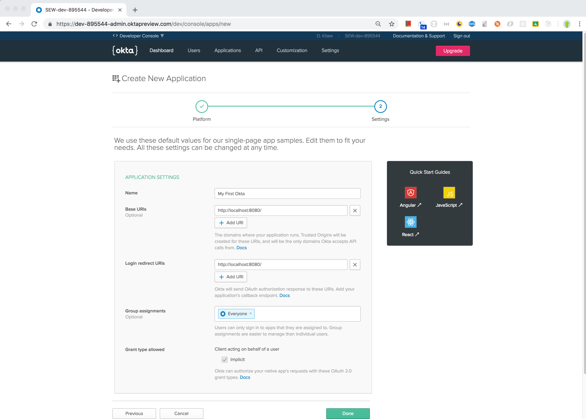
 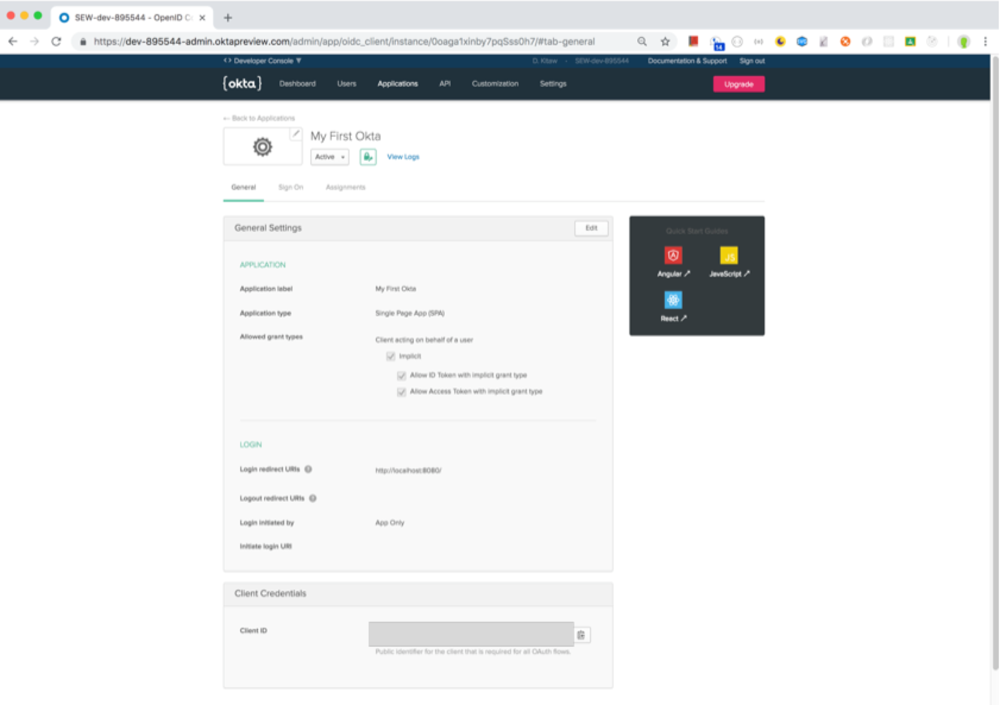
 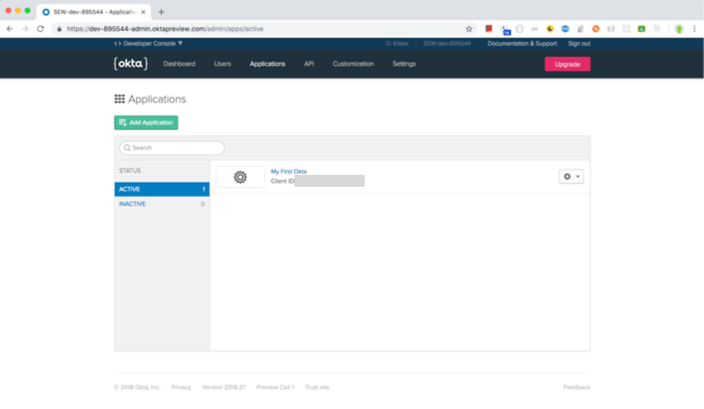
 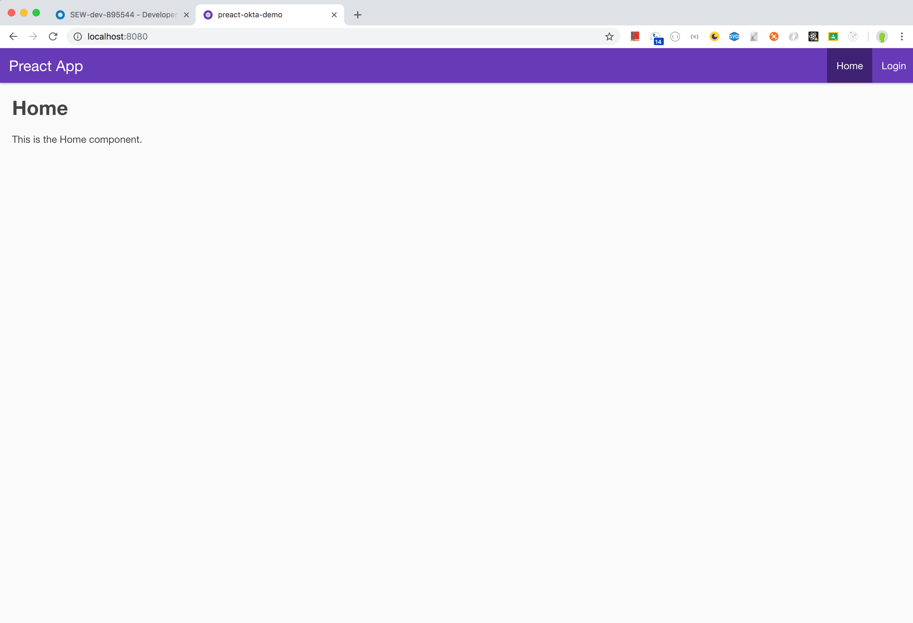
 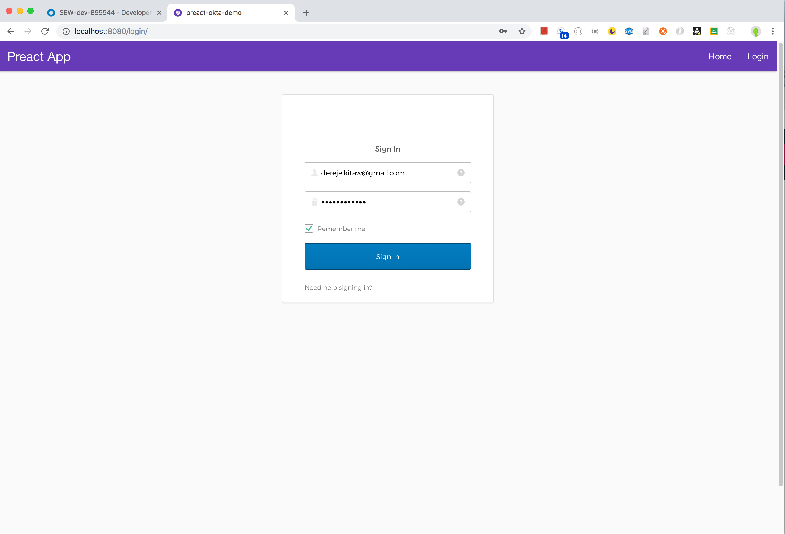
 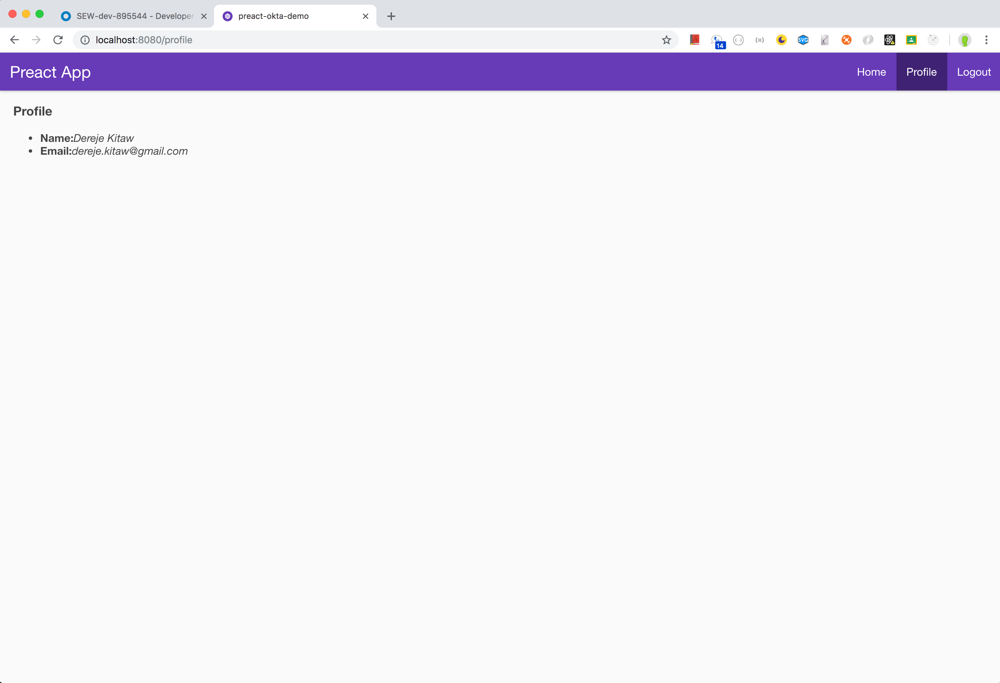
 

npm i -D fast-async
